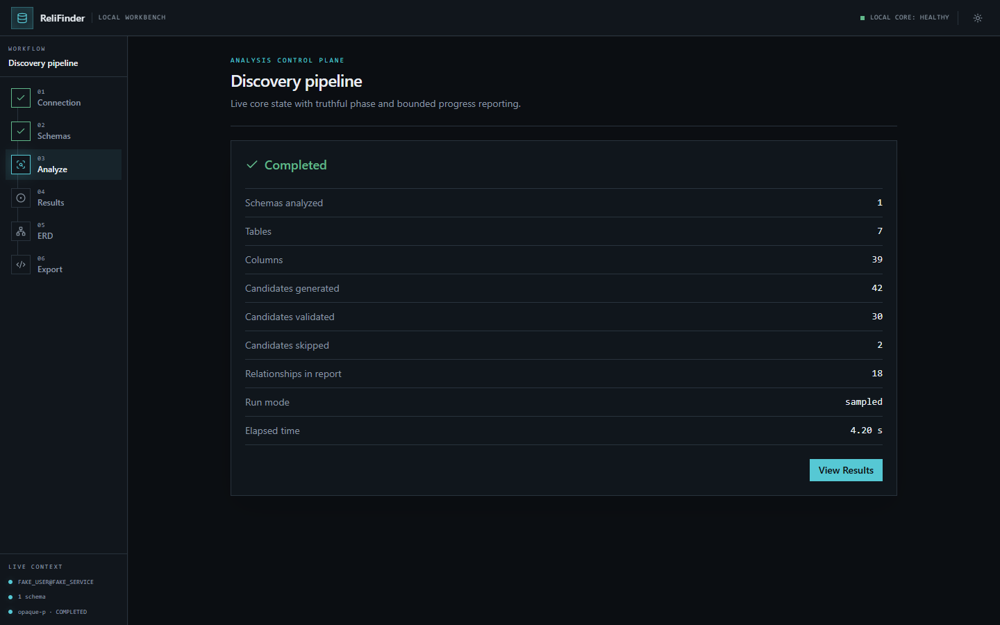
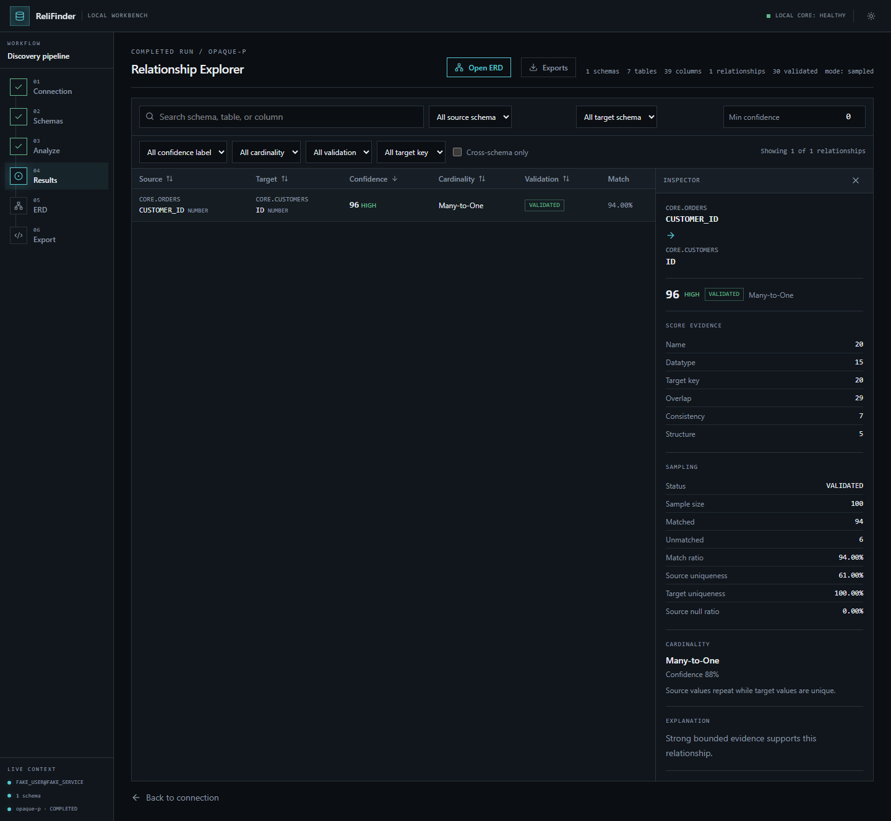
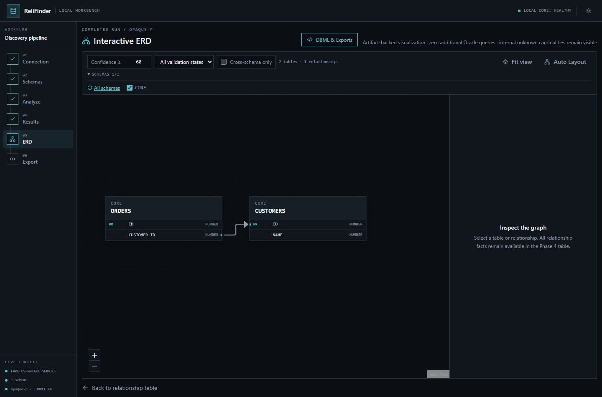
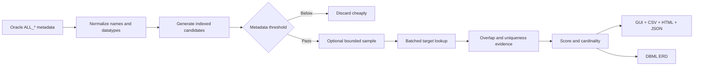

<div align="center">

# 🔎 ReliFinder

### Discover the relationships your Oracle schema forgot to declare

Local-first Oracle schema relationship discovery workbench with explainable inference, safe sampling, interactive ERD, and zero database writes.

[](https://www.python.org/)
[](https://www.oracle.com/database/)
[](https://fastapi.tiangolo.com/)
[](https://react.dev/)
[](https://github.com/mahdiyazdi83/relifinder/actions/workflows/ci.yml)
[](LICENSE)

**No DDL · No DML · No database-side changes · No sampled values in reports**

[Quick start](#quick-start) · [Screenshots](#screenshots) · [How it works](#how-it-works) · [Safety](#safety-model) · [CLI](#cli-workflows) · [Development](#development)

</div>

---

## What is ReliFinder?

Oracle estates often contain real logical relationships that were never declared as Foreign Keys. ReliFinder analyzes metadata and, when enabled, small bounded samples to turn signals such as:

```text
SALES.ORDER.CUSTOMER_ID  →  CRM.CUSTOMER.ID
```

into reviewable relationship hypotheses. Every result includes a confidence score, score breakdown, validation status, overlap aggregates, inferred cardinality, and a plain-language explanation.

ReliFinder is useful for:

- reverse-engineering legacy or integration-heavy Oracle databases;
- preparing migrations and data-model documentation;
- exploring cross-schema dependencies;
- generating DBML and interactive ER diagrams;
- finding candidates for human review without changing the database.

> [!IMPORTANT]
> ReliFinder discovers probable logical relationships. It does not create constraints, and confidence is evidence—not proof. Review important findings before using them in migrations or production decisions.

## Quick start

### Requirements

- Python 3.11+
- network access to Oracle
- a SELECT-only Oracle account with access to the required `ALL_*` metadata views

Normal GUI use does **not** require Node.js, pnpm, or a separate frontend server. Production web assets are included in the Python package.

### Clone and start

```powershell
# Windows PowerShell
git clone https://github.com/mahdiyazdi83/relifinder.git
Set-Location .\relifinder
python .\start.py
```

```bash
# Linux / macOS
git clone https://github.com/mahdiyazdi83/relifinder.git
cd relifinder
python3 ./start.py
```

`start.py` creates a private `.venv`, installs the GUI when needed, and starts ReliFinder. It uses only the Python standard library; users do not need to activate the environment or manage `pip` directly. Later launches use the same single command and skip installation while the packaging configuration is unchanged.

ReliFinder starts on `http://127.0.0.1:8741` and opens the default browser after the server is ready. Stop it with `Ctrl+C`.

Launcher options pass through unchanged:

```bash
python start.py --no-browser
python start.py --port 9000
```

For manual or development-oriented installation, the regular entry point remains available:

```powershell
# Windows PowerShell
python -m venv .venv
.\.venv\Scripts\python.exe -m pip install -e ".[gui]"
.\.venv\Scripts\relifinder.exe gui
```

```bash
# Linux / macOS
python3 -m venv .venv
./.venv/bin/python -m pip install -e ".[gui]"
./.venv/bin/relifinder gui
```

Loopback is the safe default. Binding to `0.0.0.0` or another non-loopback address can expose the workbench and its in-memory Oracle session to other machines; ReliFinder prints a warning when you do this.

## Screenshots

All screenshots below use synthetic demo metadata and fake connection details. No production database values or credentials are shown.

### Guided analysis workflow



### Explainable relationship explorer



### Interactive ERD



## Core capabilities

| Capability | What it provides |
|---|---|
| Local GUI | One Python command serves the FastAPI API and packaged React application |
| Metadata-first discovery | Candidate generation before any user-table sampling |
| Explainable scoring | Visible evidence for every confidence point |
| Safe bounded validation | Hard row limits, bind batches, timeouts, and low concurrency |
| Cross-schema analysis | Relationships across all explicitly selected schemas |
| Relationship explorer | Search, filters, sorting, evidence details, and validation aggregates |
| Interactive ERD | Deterministic layout, confidence filters, focus mode, and inspectors |
| DBML export | Full, per-schema, and cross-schema diagrams from safe artifacts |
| Immutable outputs | Timestamped run directories plus one comprehensive operational log |
| Privacy-preserving reports | No credentials, sampled values, or source rows in artifacts |

## How it works



1. **Metadata collection** reads table, column, datatype, nullability, constraint, row-estimate, and statistics metadata.
2. **Candidate generation** uses datatype families and normalized identifier semantics instead of comparing every possible column pair.
3. **Safe validation** optionally samples a bounded number of non-null source values and checks target existence with bind variables.
4. **Scoring and cardinality** combine metadata strength, overlap quality, uniqueness, and structural evidence.
5. **Artifact generation** writes aggregate-only results that the GUI can inspect without another Oracle query.

### Explainable confidence scoring

The default deterministic score totals 100 points:

| Evidence | Maximum |
|---|---:|
| Name and table semantics | 35 |
| Datatype compatibility | 15 |
| Target PK, Unique, or unique-like evidence | 15 |
| Sampled value overlap | 25 |
| Sample reliability and consistency | 5 |
| Structural metadata | 5 |

ReliFinder reduces false confidence when samples are small, a target repeats heavily, overlap is weak, or identifiers are generic (`STATUS_ID`, `TYPE_ID`, `USER_ID`, and similar). Composite-key components are never presented as complete single-column keys.

## GUI workflow

The workbench guides you through:

1. connecting with temporary in-memory credentials;
2. checking Oracle access and selecting visible schemas;
3. choosing Fast, Balanced, Thorough, or Custom analysis settings;
4. watching real progress and optionally cancelling at safe boundaries;
5. filtering and inspecting relationship evidence;
6. exploring the inferred model as an interactive ERD;
7. viewing or downloading CSV, HTML, and DBML artifacts.

Completed Results, ERD, and Export views read the completed run artifacts. They do not issue a second discovery query against Oracle.

## Safety model

ReliFinder is designed around a narrow, read-only database boundary:

- a central SQL guard accepts only a single `SELECT` statement;
- metadata reads are limited to Oracle `ALL_*` views used by discovery;
- user-table validation is bounded by configured limits and client-side timeouts;
- sampled values use bind variables and are never logged or persisted;
- connection pools and validation workers have conservative fixed limits;
- no telemetry, remote font, CDN runtime asset, cloud queue, or GUI database is used;
- the browser never submits arbitrary filesystem paths to artifact endpoints.

ReliFinder never executes `INSERT`, `UPDATE`, `DELETE`, `MERGE`, `CREATE`, `ALTER`, `DROP`, `TRUNCATE`, statistics gathering, index creation, or temporary-table creation.

> [!TIP]
> Use an Oracle account whose privileges are physically limited to `SELECT` for defense in depth. Application safeguards do not prove that the supplied account lacks write privileges.

Credentials exist only long enough to create the local connection pool. They are not returned by the API, written to output, placed in URLs, or stored by ReliFinder in browser persistence. Theme preference is the only application value persisted in the browser.

## CLI workflows

The original CLI remains fully supported. Install core-only dependencies with `python -m pip install -e .`, or use the GUI installation shown above.

### Configure Oracle

Copy the example and keep the real file local:

```powershell
Copy-Item .\config.example.yaml .\config.yaml
$env:ORACLE_PASSWORD = "your-secret"
```

```bash
cp config.example.yaml config.yaml
export ORACLE_PASSWORD="your-secret"
```

Minimal configuration:

```yaml
database:
  host: localhost
  port: 1521
  service_name: YOUR_SERVICE
  username: readonly_user
  password_env: ORACLE_PASSWORD

schemas:
  - SALES
  - CRM
```

`config.yaml`, reports, logs, wallet files, and generated database artifacts are ignored by Git. Never put a password directly in a committed YAML file.

### Metadata-only analysis

```powershell
oracle-relationship-discovery --config .\config.yaml analyze `
  --metadata-only `
  --min-confidence 60
```

```bash
oracle-relationship-discovery --config ./config.yaml analyze \
  --metadata-only \
  --min-confidence 60
```

### Bounded sampled analysis with DBML

```powershell
oracle-relationship-discovery --config .\config.yaml analyze `
  --min-confidence 60 `
  --erd `
  --erd-format dbml `
  --erd-min-confidence 80
```

```bash
oracle-relationship-discovery --config ./config.yaml analyze \
  --min-confidence 60 \
  --erd \
  --erd-format dbml \
  --erd-min-confidence 80
```

### Offline ERD export

No Oracle connection is made when exporting from an existing run:

```bash
oracle-relationship-discovery export-erd \
  --input output/your-run \
  --scope full \
  --min-confidence 80
```

The equivalent module command remains available:

```bash
python -m oracle_relationship_discovery --config config.yaml analyze
```

## Output artifacts

Each invocation creates an immutable directory containing the method and a precise local timestamp:

```text
output/
└── 2026-08-29_10-42-11-654321_+0330_sampled/
    ├── relationships.csv
    ├── relationship-report.html
    ├── analysis-results.json
    ├── schema-metadata.json
    └── erd/
        └── full.dbml

logs/
└── oracle-relationship-discovery.log
```

- `relationships.csv` is a reviewable tabular export with score and aggregate evidence.
- `relationship-report.html` is a self-contained light/dark report that works offline.
- `analysis-results.json` stores every final inference required by the GUI and offline ERD export.
- `schema-metadata.json` stores safe structural metadata used to reconstruct tables and columns.
- `erd/*.dbml` contains portable inferred diagrams and omission summaries.
- the comprehensive log is append-only across runs and remains separate from individual output folders.

These files can reveal sensitive schema names and topology even though they exclude sampled values. Treat the entire output directory as sensitive.

## Architecture

```text
relifinder gui
    └── Uvicorn on loopback
        ├── /api/*  → FastAPI session, run, result, ERD, and artifact endpoints
        └── /*      → packaged React/Vite production application
                         │
                         ▼
             shared Python analysis service
                         │
                         ▼
              bounded SELECT-only Oracle pool
```

The CLI and GUI call the same Python analysis pipeline. FastAPI owns only local transport and in-memory lifecycle; candidate generation, scoring, validation, cardinality, and artifact generation remain in the core.

The backend package lives under `src/oracle_relationship_discovery/gui`. The editable source frontend remains under `gui/web`, while its versioned production build is packaged under `src/oracle_relationship_discovery/gui/static`.

## Configuration reference

Key controls are available in the GUI and in YAML:

```yaml
analysis:
  metadata_candidate_threshold: 40
  min_report_confidence: 40

sampling:
  enabled: true
  max_source_rows: 3000
  max_target_rows: 5000
  bind_batch_size: 500
  mode: first

performance:
  max_workers: 2
  candidate_validation_limit: 1000
  query_timeout_seconds: 15

erd:
  enabled: false
  format: dbml
  min_confidence: 80
  scope: full
  schemas: []
  max_relationships: null
  exclude_generic: false
  include_isolated_tables: false
  validation_statuses: [VALIDATED, NOT_RUN, SKIPPED]
```

See [`config.example.yaml`](config.example.yaml) for the complete safe template.

## Technology stack

| Layer | Technology |
|---|---|
| Discovery engine | Python 3.11+, `python-oracledb`, PyYAML |
| Local API | FastAPI, Pydantic, Uvicorn |
| Workbench | React 19, React Router, TanStack Query, Zod |
| ERD | React Flow, ELK.js |
| UI toolchain | TypeScript, Vite, Tailwind CSS |
| Testing | pytest, Vitest, Testing Library, Playwright |
| Packaging | Hatchling with versioned production GUI assets |

## Development

Install development dependencies:

```bash
python -m pip install -e ".[gui,dev]"
cd gui/web
pnpm install --frozen-lockfile
```

Run the FastAPI adapter with reload from the repository root:

```bash
python -m uvicorn oracle_relationship_discovery.gui.app:app \
  --host 127.0.0.1 \
  --port 8000 \
  --reload
```

Run Vite in a second terminal:

```bash
cd gui/web
pnpm generate:api
pnpm dev
```

Vite listens on `127.0.0.1:5173` and proxies `/api` to the development API on port `8000`.

### Production asset maintenance

Maintainers rebuild the committed production frontend with one command from the repository root:

```bash
python scripts/build_gui.py
```

The helper performs a frozen pnpm install, regenerates the OpenAPI TypeScript contract with the active Python interpreter, builds Vite, places assets inside the Python package, and validates them. A lightweight check detects missing or stale committed assets without requiring Node.js:

```bash
python scripts/build_gui.py --check
```

### Verification

```bash
pytest
ruff check src tests scripts

cd gui/web
pnpm lint
pnpm typecheck
pnpm test:run
pnpm build
pnpm test:e2e
```

Python GUI tests replace the Oracle gateway and analysis executor; frontend tests use synthetic fixtures. Real Oracle behavior still requires integration testing against each target version, driver mode, privilege model, network, and workload.

## Known limitations

- Inferred relationships are currently single-column; composite targets are excluded safely.
- Sampling is bounded and can be biased.
- Cardinality does not infer complete optionality.
- Synonyms, views, and partition-specific strategies are not analyzed yet.
- Existing declared Foreign Keys are not emitted as newly discovered relationships.
- GUI connection sessions, run records, and caches are intentionally in memory and disappear when the process stops.
- Cooperative cancellation cannot terminate an Oracle call already in progress; it takes effect at the next safe boundary or timeout.
- Large ERDs can remain visually dense even with filters, deterministic layout, and one-hop focus.

## Contributing

Issues and pull requests are welcome. Keep changes aligned with this priority order: database safety, correctness, explainability, performance, and coverage.

Before submitting a pull request, run the verification commands, rebuild packaged GUI assets when frontend or API contracts change, and confirm that no real configuration, credentials, reports, logs, wallet files, or database-derived screenshots are staged.

## License

ReliFinder is available under the [MIT License](LICENSE).

<div align="center">

Built for safer Oracle schema discovery.

</div>