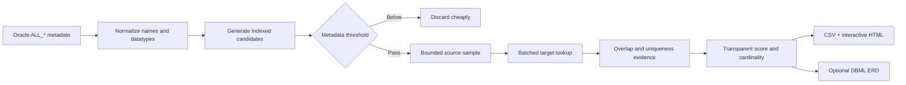

<div align="center">

# 🔎 ReliFinder

### Explainable relationship discovery for Oracle schemas without Foreign Keys

ReliFinder safely reverse-engineers probable logical relationships between Oracle tables using metadata-first analysis and bounded, privacy-preserving sampling.

[](https://www.python.org/)
[](https://www.oracle.com/database/)
[](https://python-oracledb.readthedocs.io/)
[](#development)
[](LICENSE)

**No DDL · No DML · No database-side changes · No sampled values in reports**

[Quick start](#quick-start) · [How it works](#how-it-works) · [Scoring](#transparent-confidence-scoring) · [Reports](#reports) · [Safety](#safety-and-privacy)

</div>

---

## Why ReliFinder?

Legacy and integration-heavy Oracle systems often contain real relationships that were never declared as Foreign Keys. That makes documentation, migration planning, impact analysis, and ERD generation unnecessarily difficult.

ReliFinder turns signals such as:

```text
SCHEMA_A.REQUEST.PARTY_ID  →  SCHEMA_B.PARTY.ID
```

into an explainable hypothesis with a bounded confidence score, sampled overlap statistics, and probabilistic cardinality—without modifying the database.

> [!IMPORTANT]
> ReliFinder does not create Foreign Key constraints. It only discovers probable logical relationships. Every inferred relationship should be manually reviewed before it is used for migrations or schema changes.

## Highlights

| Capability | What it provides |
|---|---|
| 🛡️ Strictly read-only | A central SQL guard accepts only single `SELECT` statements |
| 🧭 Metadata-first | Candidates are generated before any user-table sampling |
| 🧠 Explainable scoring | Every confidence point is tied to visible evidence |
| 📦 Bounded sampling | Hard row limits, batched binds, timeouts, and low concurrency |
| 🔗 Cross-schema discovery | Relationships can span every configured Oracle schema |
| 🧩 Composite-key safety | A composite key component is never treated as a complete key |
| 🔐 Privacy-preserving | Actual sampled values are never logged or persisted |
| 🌗 Interactive report | Self-contained HTML with light/dark themes, filters, and sorting |
| 🗺️ DBML ERD export | Confidence-filtered full, per-schema, and cross-schema diagrams |
| 🗂️ Immutable runs | Every invocation gets a timestamped, method-specific directory |
| 🧪 Oracle-independent tests | Core inference logic is tested without pretending to verify Oracle itself |

## How it works



### Analysis phases

1. **Metadata collection** — Reads tables, columns, datatype details, nullability, PK/Unique constraints, estimated row counts, and statistics timestamps from `ALL_*` views.
2. **Candidate generation** — Uses indexed datatype families and semantic identifier roots instead of querying every column pair.
3. **Safe validation** — Samples a bounded number of non-null source values and checks target existence with batched bind variables.
4. **Cardinality inference** — Combines declared target uniqueness with observed source duplication.
5. **Reporting** — Emits aggregate-only CSV and self-contained HTML artifacts.

## Transparent confidence scoring

The default deterministic score totals 100 points:

| Evidence | Maximum |
|---|---:|
| Name and table semantics | 35 |
| Datatype compatibility | 15 |
| Target PK / Unique / unique-like evidence | 15 |
| Sampled value overlap | 25 |
| Sample reliability and consistency | 5 |
| Structural metadata | 5 |

Confidence labels:

| Score | Label |
|---:|---|
| 90–100 | `HIGH` |
| 75–89.99 | `MEDIUM-HIGH` |
| 60–74.99 | `MEDIUM` |
| 40–59.99 | `LOW` |
| Below 40 | `VERY LOW` |

ReliFinder deliberately resists common false positives:

- Samples below 100 rows receive proportionally less data-evidence weight.
- Repeating non-key targets receive heavily discounted overlap evidence.
- A sampled target becomes *unique-like* only with at least 100 rows and 99% uniqueness.
- `One-to-One` is not inferred from fewer than 30 unique-looking source values.
- Generic identifiers such as `STATUS_ID`, `TYPE_ID`, and `USER_ID` are penalized.
- Physical prefixes such as `TB_`, `TBL_`, and `VW_` are removed before table-affinity comparison.
- Low overlap actively downweights otherwise convincing metadata signals.

Every row includes the complete score breakdown and a plain-language explanation.

## Safety and privacy

Safety is the first design priority.

ReliFinder never executes:

```text
INSERT  UPDATE  DELETE  MERGE  CREATE  ALTER  DROP
TRUNCATE  PL/SQL mutation  temporary table creation
index creation  statistics gathering
```

Database access is limited to:

- `SELECT` queries against `ALL_TABLES`, `ALL_TAB_COLUMNS`, `ALL_CONSTRAINTS`, and `ALL_CONS_COLUMNS`;
- bounded `SELECT` queries against configured user tables;
- bind variables for every sampled value;
- validated and quoted Oracle identifiers;
- a fixed-size connection pool and client-side call timeout.

It never performs full table-to-table validation joins, unlimited `COUNT(DISTINCT ...)`, or expensive `ORDER BY DBMS_RANDOM.VALUE` sampling.

> [!TIP]
> Use an Oracle account whose privileges are physically limited to `SELECT` for defense in depth.

## Quick start

### Requirements

- Python 3.11+
- Network access to Oracle
- A SELECT-only Oracle account
- Access to the required `ALL_*` metadata views

`python-oracledb` uses Thin mode by default, so Oracle Client libraries are usually unnecessary.

### Install

```bash
git clone https://github.com/mahdiyazdi83/relifinder.git
cd relifinder
python -m venv .venv
```

Activate the environment:

```powershell
# Windows PowerShell
.\.venv\Scripts\Activate.ps1
```

```bash
# Linux / macOS
source .venv/bin/activate
```

Install ReliFinder:

```bash
python -m pip install -e .
```

### Configure

Copy the safe example file. Never commit your real configuration.

```powershell
Copy-Item .\config.example.yaml .\config.yaml
$env:ORACLE_PASSWORD = "your-secret"
```

```bash
cp config.example.yaml config.yaml
export ORACLE_PASSWORD="your-secret"
```

Minimal configuration:

```yaml
database:
  host: localhost
  port: 1521
  service_name: YOUR_SERVICE
  username: readonly_user
  password_env: ORACLE_PASSWORD

schemas:
  - SCHEMA_A
  - SCHEMA_B
```

The password is read from the named environment variable and never belongs in YAML.

## Usage

### Start with metadata only

```bash
oracle-relationship-discovery --config config.yaml analyze \
  --metadata-only \
  --min-confidence 60
```

### Run bounded sampled validation

```bash
oracle-relationship-discovery --config config.yaml analyze \
  --min-confidence 60
```

### Additional options

```text
--metadata-only       Do not query user-table values
--disable-sampling    Alias for --metadata-only
--min-confidence N    Minimum score written to reports
--output-dir PATH     Override the output root
--verbose             Enable DEBUG logging
```

The equivalent module invocation is:

```bash
python -m oracle_relationship_discovery --config config.yaml analyze
```

## Reports

Each invocation creates an immutable run directory with local date, exact time, timezone, and method:

```text
output/
├── 2026-08-29_10-20-30-123456_+0330_metadata-only/
│   ├── relationships.csv
│   ├── relationship-report.html
│   ├── schema-metadata.json
│   └── erd/full.dbml
└── 2026-08-29_10-42-11-654321_+0330_sampled/
    ├── relationships.csv
    ├── relationship-report.html
    ├── schema-metadata.json
    └── erd/full.dbml

logs/
└── oracle-relationship-discovery.log
```

The comprehensive log is append-only across runs. Each run is clearly delimited with its ID, mode, timestamp, and artifact path.

### Interactive HTML

The self-contained report works directly from disk and includes:

- explicit light and dark themes with persisted preference;
- confidence-distribution visualization;
- schema, confidence, cardinality, target-key, and validation filters;
- search and sortable columns;
- overlap bars and sample-quality indicators;
- expandable score evidence and explanations;
- no backend, CDN, or external assets.

### CSV

`relationships.csv` includes provenance, direction, datatype, key type, confidence components, cardinality, aggregate sampling evidence, validation status, and explanation. It never contains actual sampled values.

## ERD export

ReliFinder can turn the relationships it already inferred into portable DBML for dbdiagram.io and other DBML-compatible viewers. DBML was selected because it is text-based, reviewable in version control, schema-aware, and widely supported. The exporter is a presentation layer only: it performs no database queries and never discovers or rescans relationships.

> [!WARNING]
> The generated ERD visualizes ReliFinder's inferred logical relationships. It does not represent declared Oracle Foreign Key constraints unless explicitly identified as such.

### Generate DBML during analysis

~~~bash
oracle-relationship-discovery   --config config.yaml   analyze   --erd   --erd-format dbml   --erd-min-confidence 80
~~~

The default threshold is 80. CLI options override the <code>erd</code> section in YAML. Only final inferred relationships at or above the threshold are included; the threshold and aggregate evidence are recorded in the DBML comments.

~~~yaml
erd:
  enabled: false
  format: dbml
  min_confidence: 80
  scope: full
  schemas: []
  max_relationships: null
  exclude_generic: false
~~~

### Choose a scope

| Scope | Output | Meaning |
|---|---|---|
| <code>full</code> | <code>erd/full.dbml</code> | All qualifying relationships |
| <code>schema</code> | <code>erd/schemas/SCHEMA.dbml</code> | One file per selected/configured schema; referenced external tables are marked |
| <code>cross-schema</code> | <code>erd/cross-schema.dbml</code> | Only relationships crossing Oracle schema boundaries |

Use <code>--erd-schema SCHEMA_A</code> repeatedly to focus the export. Use <code>--erd-max-relationships N</code> to cap large diagrams deterministically by confidence and qualified name. Generic lookup relationships remain included by default; <code>--erd-exclude-generic</code> removes recognized generic entities from visualization only.

### Export an existing run without Oracle

Every analysis writes a safe <code>schema-metadata.json</code> containing table, column, datatype, nullability, and key metadata—never sampled values. It enables a complete offline export:

~~~bash
oracle-relationship-discovery export-erd   --input output/RUN/relationships.csv   --format dbml   --min-confidence 80   --scope cross-schema
~~~

The command automatically uses <code>schema-metadata.json</code> beside the CSV. Pass <code>--metadata PATH</code> to select another artifact. If metadata is unavailable, ReliFinder still creates a minimal DBML file from the columns present in the CSV.

Open the resulting <code>.dbml</code> file in a DBML-compatible viewer. The HTML report also lists generated files, scope, threshold, and relationship count.

Cardinality mapping is conservative:

| ReliFinder | DBML |
|---|---|
| <code>Many-to-One</code> | <code>&gt;</code> |
| <code>One-to-Many</code> | <code>&lt;</code> |
| <code>One-to-One</code> | <code>-</code> |
| Unknown / insufficient evidence | No Ref is invented; evidence is retained in comments |

Current ERD limitations: relationships are single-column, optionality is not inferred completely, and DBML rendering/layout is controlled by the chosen viewer. Oracle datatypes are preserved for documentation rather than converted for migration.
## Configuration reference

<details>
<summary><strong>Analysis and scoring</strong></summary>

```yaml
analysis:
  metadata_candidate_threshold: 40
  min_report_confidence: 40
  generic_entities: [STATUS, TYPE, USER, CODE, CATEGORY, KIND]
  weights:
    name: 35
    datatype: 15
    target_key: 15
    overlap: 25
    consistency: 5
    structure: 5
```

Weights must include all components and total exactly 100.

</details>

<details>
<summary><strong>Sampling and load protection</strong></summary>

```yaml
sampling:
  enabled: true
  max_source_rows: 3000
  max_target_rows: 5000
  bind_batch_size: 500
  mode: first

performance:
  max_workers: 2
  candidate_validation_limit: 1000
  query_timeout_seconds: 15
```

`first` uses `ROWNUM` without an expensive sort. `sample` adds Oracle `SAMPLE BLOCK (1)` before the same hard row limit.

</details>

## Architecture

```text
src/oracle_relationship_discovery/
├── analysis/
│   ├── candidate_generator.py
│   ├── cardinality.py
│   ├── datatype.py
│   ├── name_similarity.py
│   ├── relationship_validator.py
│   └── scorer.py
├── db/
│   ├── connection.py
│   ├── data_sampler.py
│   └── metadata_repository.py
├── output/
│   ├── csv_report.py
│   └── html_report.py
├── cli.py
├── config.py
└── models.py
```

The analysis package is pure Python logic and has no Oracle dependency. Database integration, orchestration, and presentation remain separate.

## Technology stack

| Technology | Role |
|---|---|
| Python 3.11+ | Application and inference engine |
| `python-oracledb` | Official Oracle database driver |
| PyYAML | Human-readable configuration |
| `dataclasses` and type hints | Explicit domain models |
| `concurrent.futures` | Conservative bounded validation concurrency |
| HTML, CSS, vanilla JavaScript | Portable interactive report |
| DBML | Portable ERD interchange format |
| pytest | Oracle-independent unit tests |
| Ruff | Formatting and static quality checks |
| Hatchling | Standards-based package builds |

## Development

```bash
python -m pip install -e ".[dev]"
pytest
ruff check src tests
python -m compileall -q src
```

Unit tests cover name normalization, datatype compatibility, generic-ID protection, candidate generation, score reliability, confidence labels, cardinality, composite-key safety, report privacy, run isolation, logging, and the SELECT-only SQL guard.

Tests do not mock Oracle and do not claim that real Oracle queries have been verified. Integration testing is required against each target Oracle version and workload profile.

## Known limitations

- Multi-column logical relationship inference is not implemented; composite targets are excluded safely.
- Sampling is bounded and may be biased; confidence is evidence, not proof.
- Cardinality does not infer complete optionality.
- Only conventional uppercase-compatible Oracle identifiers are supported.
- Synonyms, views, and partition-specific strategies are not analyzed yet.
- Existing Foreign Keys are not emitted as discovered logical relationships in this version.

## Contributing

Issues and pull requests are welcome. Please keep changes aligned with the project priorities:

1. Database safety
2. Correctness
3. Explainability
4. Performance
5. Coverage

Before submitting a pull request, run the complete test and lint suite and never include real configurations, reports, logs, wallet files, or sampled data.

## License

ReliFinder is available under the [MIT License](LICENSE).

<div align="center">

Built for safer Oracle schema discovery.

</div>