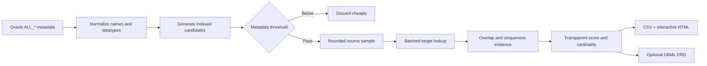

<div align="center">

# 🔎 ReliFinder

### Explainable relationship discovery for Oracle schemas without Foreign Keys

ReliFinder safely reverse-engineers probable logical relationships between Oracle tables using metadata-first analysis and bounded, privacy-preserving sampling.

[](https://www.python.org/)
[](https://www.oracle.com/database/)
[](https://python-oracledb.readthedocs.io/)
[](#development)
[](LICENSE)

**No DDL · No DML · No database-side changes · No sampled values in reports**

[Quick start](#quick-start) · [How it works](#how-it-works) · [Scoring](#transparent-confidence-scoring) · [Reports](#reports) · [Safety](#safety-and-privacy)

</div>

---

## Why ReliFinder?

Legacy and integration-heavy Oracle systems often contain real relationships that were never declared as Foreign Keys. That makes documentation, migration planning, impact analysis, and ERD generation unnecessarily difficult.

ReliFinder turns signals such as:

```text
SCHEMA_A.REQUEST.PARTY_ID  →  SCHEMA_B.PARTY.ID
```

into an explainable hypothesis with a bounded confidence score, sampled overlap statistics, and probabilistic cardinality—without modifying the database.

> [!IMPORTANT]
> ReliFinder does not create Foreign Key constraints. It only discovers probable logical relationships. Every inferred relationship should be manually reviewed before it is used for migrations or schema changes.

## Highlights

| Capability | What it provides |
|---|---|
| 🛡️ Strictly read-only | A central SQL guard accepts only single `SELECT` statements |
| 🧭 Metadata-first | Candidates are generated before any user-table sampling |
| 🧠 Explainable scoring | Every confidence point is tied to visible evidence |
| 📦 Bounded sampling | Hard row limits, batched binds, timeouts, and low concurrency |
| 🔗 Cross-schema discovery | Relationships can span every configured Oracle schema |
| 🧩 Composite-key safety | A composite key component is never treated as a complete key |
| 🔐 Privacy-preserving | Actual sampled values are never logged or persisted |
| 🌗 Interactive report | Self-contained HTML with light/dark themes, filters, and sorting |
| 🗺️ DBML ERD export | Confidence-filtered full, per-schema, and cross-schema diagrams |
| 🗂️ Immutable runs | Every invocation gets a timestamped, method-specific directory |
| 🧪 Oracle-independent tests | Core inference logic is tested without pretending to verify Oracle itself |

## How it works



### Analysis phases

1. **Metadata collection** — Reads tables, columns, datatype details, nullability, PK/Unique constraints, estimated row counts, and statistics timestamps from `ALL_*` views.
2. **Candidate generation** — Uses indexed datatype families and semantic identifier roots instead of querying every column pair.
3. **Safe validation** — Samples a bounded number of non-null source values and checks target existence with batched bind variables.
4. **Cardinality inference** — Combines declared target uniqueness with observed source duplication.
5. **Reporting** — Emits aggregate-only CSV and self-contained HTML artifacts.

## Transparent confidence scoring

The default deterministic score totals 100 points:

| Evidence | Maximum |
|---|---:|
| Name and table semantics | 35 |
| Datatype compatibility | 15 |
| Target PK / Unique / unique-like evidence | 15 |
| Sampled value overlap | 25 |
| Sample reliability and consistency | 5 |
| Structural metadata | 5 |

Confidence labels:

| Score | Label |
|---:|---|
| 90–100 | `HIGH` |
| 75–89.99 | `MEDIUM-HIGH` |
| 60–74.99 | `MEDIUM` |
| 40–59.99 | `LOW` |
| Below 40 | `VERY LOW` |

ReliFinder deliberately resists common false positives:

- Samples below 100 rows receive proportionally less data-evidence weight.
- Repeating non-key targets receive heavily discounted overlap evidence.
- A sampled target becomes *unique-like* only with at least 100 rows and 99% uniqueness.
- `One-to-One` is not inferred from fewer than 30 unique-looking source values.
- Generic identifiers such as `STATUS_ID`, `TYPE_ID`, and `USER_ID` are penalized.
- Physical prefixes such as `TB_`, `TBL_`, and `VW_` are removed before table-affinity comparison.
- Low overlap actively downweights otherwise convincing metadata signals.

Every row includes the complete score breakdown and a plain-language explanation.

## Safety and privacy

Safety is the first design priority.

ReliFinder never executes:

```text
INSERT  UPDATE  DELETE  MERGE  CREATE  ALTER  DROP
TRUNCATE  PL/SQL mutation  temporary table creation
index creation  statistics gathering
```

Database access is limited to:

- `SELECT` queries against `ALL_TABLES`, `ALL_TAB_COLUMNS`, `ALL_CONSTRAINTS`, and `ALL_CONS_COLUMNS`;
- bounded `SELECT` queries against configured user tables;
- bind variables for every sampled value;
- validated and quoted Oracle identifiers;
- a fixed-size connection pool and client-side call timeout.

It never performs full table-to-table validation joins, unlimited `COUNT(DISTINCT ...)`, or expensive `ORDER BY DBMS_RANDOM.VALUE` sampling.

> [!TIP]
> Use an Oracle account whose privileges are physically limited to `SELECT` for defense in depth.

## Quick start

### Requirements

- Python 3.11+
- Network access to Oracle
- A SELECT-only Oracle account
- Access to the required `ALL_*` metadata views

`python-oracledb` uses Thin mode by default, so Oracle Client libraries are usually unnecessary.

### Install

```bash
git clone https://github.com/mahdiyazdi83/relifinder.git
cd relifinder
python -m venv .venv
```

Activate the environment:

```powershell
# Windows PowerShell
.\.venv\Scripts\Activate.ps1
```

```bash
# Linux / macOS
source .venv/bin/activate
```

Install ReliFinder:

```bash
python -m pip install -e .
```

### Configure

Copy the safe example file. Never commit your real configuration.

```powershell
Copy-Item .\config.example.yaml .\config.yaml
$env:ORACLE_PASSWORD = "your-secret"
```

```bash
cp config.example.yaml config.yaml
export ORACLE_PASSWORD="your-secret"
```

Minimal configuration:

```yaml
database:
  host: localhost
  port: 1521
  service_name: YOUR_SERVICE
  username: readonly_user
  password_env: ORACLE_PASSWORD

schemas:
  - SCHEMA_A
  - SCHEMA_B
```

The password is read from the named environment variable and never belongs in YAML.

## Usage

### Start with metadata only

```bash
oracle-relationship-discovery --config config.yaml analyze \
  --metadata-only \
  --min-confidence 60
```

### Run bounded sampled validation

```bash
oracle-relationship-discovery --config config.yaml analyze \
  --min-confidence 60
```

### Additional options

```text
--metadata-only       Do not query user-table values
--disable-sampling    Alias for --metadata-only
--min-confidence N    Minimum score written to reports
--output-dir PATH     Override the output root
--verbose             Enable DEBUG logging
```

The equivalent module invocation is:

```bash
python -m oracle_relationship_discovery --config config.yaml analyze
```

## Reports

Each invocation creates an immutable run directory with local date, exact time, timezone, and method:

```text
output/
├── 2026-08-29_10-20-30-123456_+0330_metadata-only/
│   ├── relationships.csv
│   ├── relationship-report.html
│   ├── schema-metadata.json
│   ├── analysis-results.json
│   └── erd/full.dbml
└── 2026-08-29_10-42-11-654321_+0330_sampled/
    ├── relationships.csv
    ├── relationship-report.html
    ├── schema-metadata.json
    ├── analysis-results.json
    └── erd/full.dbml

logs/
└── oracle-relationship-discovery.log
```

The comprehensive log is append-only across runs. Each run is clearly delimited with its ID, mode, timestamp, and artifact path.

### Interactive HTML

The self-contained report works directly from disk and includes:

- explicit light and dark themes with persisted preference;
- confidence-distribution visualization;
- schema, confidence, cardinality, target-key, and validation filters;
- search and sortable columns;
- overlap bars and sample-quality indicators;
- expandable score evidence and explanations;
- no backend, CDN, or external assets.

### CSV

`relationships.csv` includes provenance, direction, datatype, key type, confidence components, cardinality, aggregate sampling evidence, validation status, and explanation. It never contains actual sampled values.

## ERD export

ReliFinder discovers probable logical relationships; the ERD only visualizes those inferences. It never converts them into Oracle Foreign Key constraints. DBML is used because it is portable, reviewable text with native schema-qualified tables.

### GUI connection and schema discovery (Phase 2)

The GUI is a **local-first developer workbench**. Phase 2 adds secure Oracle connection verification and metadata-only schema selection while keeping the existing Python inference core authoritative.

**Implemented:**

- connection form for host, port, service name, username, and password;
- request-scoped Oracle authentication and trivial `SELECT 1 FROM DUAL` verification;
- required access checks for `ALL_TABLES`, `ALL_TAB_COLUMNS`, `ALL_CONSTRAINTS`, and `ALL_CONS_COLUMNS`;
- runtime session IDs with a 15-minute idle timeout, a 16-session bound, replacement, and disconnect;
- deterministic schema summaries from Oracle metadata with table and column counts;
- search, individual selection, select-visible, clear, selected totals, and optional system schemas;
- real workflow state through “Ready to configure analysis” without starting analysis;
- typed OpenAPI contracts, sanitized error categories, unit tests, and a mocked Playwright flow.

**Planned for later phases:** analysis configuration/execution, progress, relationship exploration, ERD rendering, exports, and run history. The Analysis route is only an explicit locked placeholder.

### GUI architecture

```text
React + TypeScript (gui/web)
        ↓ relative /api
FastAPI local adapter (gui/api)
        ↓ request-scoped context manager
ReliFinder Python core (src/oracle_relationship_discovery)
        ↓ SELECT-only operations
Oracle
```

FastAPI is an adapter boundary; scoring, inference, sampling, and cardinality logic remain in the existing core. There is no GUI database, authentication layer, telemetry, remote font, CDN runtime asset, or cloud dependency.

`POST /api/connections` verifies Oracle and captures schema summaries during one bounded connection. The Oracle connection is always closed when that request finishes. The supplied password is held only in a temporary in-memory buffer and cleared immediately after verification. The returned opaque session stores only the metadata snapshot—no password and no live Oracle connection. `GET /api/connections/{id}/schemas` reads that snapshot, and `DELETE /api/connections/{id}` invalidates it. Restarting the API invalidates every session.

System classification uses `ALL_USERS.ORACLE_MAINTAINED` when Oracle provides it. On older versions, only the conservative `SYS` and `SYSTEM` fallback is classified as system. The UI hides classified system schemas by default but provides an explicit toggle; no application-schema blacklist is used.

### GUI requirements and setup

- Python 3.11+
- Node.js 24 LTS (`gui/web/.nvmrc`)
- pnpm 11 (`packageManager` is pinned in `package.json`)

From the repository root, install the optional GUI and development dependencies and start the loopback-only API:

```bash
python -m pip install -e ".[gui,dev]"
python -m uvicorn gui.api.app:app --host 127.0.0.1 --port 8000 --reload
```

In a second terminal with the same Python environment activated:

```bash
cd gui/web
pnpm install
pnpm generate:api
pnpm dev
```

Vite listens on `127.0.0.1:5173` and proxies `/api` to `127.0.0.1:8000`. `pnpm generate:api` creates `src/api/schema.d.ts` from FastAPI OpenAPI; the generated file must not be edited manually. Production assets are created in `gui/web/dist/`; serving them from FastAPI remains deferred.

Frontend verification commands are:

```bash
pnpm lint
pnpm typecheck
pnpm test:run
pnpm build
pnpm exec playwright install chromium
pnpm test:e2e
```

If the Playwright CDN is unavailable but system Chrome is installed, set `PLAYWRIGHT_CHANNEL=chrome` for the E2E command.

### GUI security conventions

- API development binds to `127.0.0.1`; no permissive CORS middleware is installed.
- Credentials are never stored by ReliFinder in browser persistence, files, URLs, logs, API responses, or `VITE_*` variables.
- The password field uses `autocomplete="current-password"`: standard browser password managers are not deliberately disabled, but their behavior is controlled by the browser rather than ReliFinder.
- Frontend-visible Oracle failures are mapped to safe categories and contain no raw descriptors, tracebacks, credentials, or filesystem paths.
- Theme preference is the only browser-persisted application value.
- ReliFinder itself executes SELECT statements only. This does **not** prove that the supplied Oracle account lacks write privileges.

Actual Oracle connection behavior requires integration testing against a real Oracle instance.

## Architecture and privacy

~~~text
Oracle analysis
      ↓
analysis-results.json + schema-metadata.json
      ↓
ERD model and deterministic filters
      ↓
DBML exporter
~~~

Every new run writes two versioned, safe artifacts:

- <code>analysis-results.json</code> contains every final analyzed relationship before the CSV report threshold, including score components and aggregate validation evidence.
- <code>schema-metadata.json</code> contains schema, table, column, datatype, nullability, key, and constraint metadata.

Neither artifact stores raw sampled values, credentials, or rows. ERD generation performs no extra Oracle query, and offline export makes no Oracle connection.

### Generate DBML during analysis

~~~bash
oracle-relationship-discovery \
  --config config.yaml \
  analyze \
  --erd \
  --erd-format dbml \
  --erd-min-confidence 80
~~~

~~~yaml
erd:
  enabled: false
  format: dbml
  min_confidence: 80
  scope: full
  schemas: []
  max_relationships: null
  exclude_generic: false
  include_isolated_tables: false
  validation_statuses: [VALIDATED, NOT_RUN, SKIPPED]
~~~

CLI values override configuration. The default validation filter excludes <code>FAILED</code>, while retaining <code>VALIDATED</code>, <code>NOT_RUN</code>, and <code>SKIPPED</code>. <code>SKIPPED</code> is retained because it can mean sampling was intentionally disabled, no non-null bounded sample existed, or the operational validation limit was reached—not that the inferred metadata relationship is false.

Override the allowed statuses by repeating the option:

~~~bash
oracle-relationship-discovery --config config.yaml analyze --erd \
  --erd-validation-status VALIDATED \
  --erd-validation-status NOT_RUN
~~~

### Filtering pipeline

~~~text
All final analyzed relationships
  → exact directional deduplication
  → confidence threshold
  → validation status
  → scope and schema
  → optional generic-entity exclusion
  → deterministic confidence/name ordering
  → maximum relationship limit
  → cardinality-aware DBML rendering
~~~

Reverse-direction relationships are not automatically deduplicated because direction identifies the inferred referencing column.

### Scopes and isolated tables

| Scope | Output | Behavior |
|---|---|---|
| <code>full</code> | <code>erd/full.dbml</code> | All qualifying relationships |
| <code>schema</code> | <code>erd/schemas/SCHEMA.dbml</code> | One file per selected schema; referenced external tables are marked |
| <code>cross-schema</code> | <code>erd/cross-schema.dbml</code> | Only relationships crossing schema boundaries |

By default, only tables needed by qualifying relationships are emitted. Use <code>--erd-include-isolated-tables</code> to include unrelated tables in full and schema exports. Cross-schema scope intentionally ignores this option because unrelated tables would obscure its purpose.

Use <code>--erd-schema SCHEMA_A</code> repeatedly to focus an export, <code>--erd-max-relationships N</code> for a deterministic cap, and <code>--erd-exclude-generic</code> to hide recognized lookup entities from visualization only.

### Offline export

New runs prefer <code>analysis-results.json</code>, so a later offline export can lower the ERD threshold below the original CSV report threshold without reconnecting to Oracle:

~~~bash
oracle-relationship-discovery export-erd \
  --input output/RUN \
  --format dbml \
  --min-confidence 60 \
  --scope cross-schema
~~~

The input may be a run directory, <code>analysis-results.json</code>, or a legacy <code>relationships.csv</code>. If a CSV is supplied and a sibling <code>analysis-results.json</code> exists, the richer artifact wins automatically. Older CSV-only runs remain supported, but relationships already removed by the original report threshold cannot be recovered; ReliFinder logs this limitation. Without <code>schema-metadata.json</code>, legacy export produces minimal table definitions from CSV endpoints.

### Unknown cardinality and export statistics

ReliFinder never invents cardinality to make a line appear. DBML supports Many-to-One (<code>&gt;</code>), One-to-Many (<code>&lt;</code>), and One-to-One (<code>-</code>) but has no neutral unknown operator. A qualifying unknown-cardinality relationship is preserved as evidence comments while its <code>Ref</code> is omitted.

DBML headers, logs, and the self-contained HTML report distinguish eligible relationships, rendered references, validation omissions, unknown-cardinality omissions, limit omissions, included tables, and isolated tables. Therefore a user can see when the number of rendered lines differs from the number of qualifying inferences.

Open generated files in dbdiagram.io or another DBML-compatible viewer. Viewer layout is external to ReliFinder.

Current limitations: inferred relationships are single-column, optionality is not fully inferred, older CSV-only runs cannot restore discarded relationships, and complex Oracle datatypes are preserved as quoted DBML type names when necessary rather than translated to another SQL dialect.
## Configuration reference

<details>
<summary><strong>Analysis and scoring</strong></summary>

```yaml
analysis:
  metadata_candidate_threshold: 40
  min_report_confidence: 40
  generic_entities: [STATUS, TYPE, USER, CODE, CATEGORY, KIND]
  weights:
    name: 35
    datatype: 15
    target_key: 15
    overlap: 25
    consistency: 5
    structure: 5
```

Weights must include all components and total exactly 100.

</details>

<details>
<summary><strong>Sampling and load protection</strong></summary>

```yaml
sampling:
  enabled: true
  max_source_rows: 3000
  max_target_rows: 5000
  bind_batch_size: 500
  mode: first

performance:
  max_workers: 2
  candidate_validation_limit: 1000
  query_timeout_seconds: 15
```

`first` uses `ROWNUM` without an expensive sort. `sample` adds Oracle `SAMPLE BLOCK (1)` before the same hard row limit.

</details>

## GUI foundation (Phase 1)

The GUI is an **early local-first foundation**, not a complete database workflow. Phase 1 implements the application shell and API boundary while keeping the existing Python inference core authoritative.

**Implemented:**

- restrained technical workbench shell with dark and light themes;
- centralized React Router configuration and a Not Found route;
- TanStack Query health check against `GET /api/health`;
- typed API contracts generated from FastAPI OpenAPI;
- sanitized API error contract and a relative `/api` client;
- Vitest/Testing Library tests and one Playwright shell smoke test;
- static production output in `gui/web/dist/`.

**Planned for later phases:** Oracle connection UI, schema discovery, analysis execution, relationship exploration, ERD rendering, exports, and run history. None of these workflows are represented as implemented today.

### GUI architecture

```text
React + TypeScript (gui/web)
        ↓ relative /api
FastAPI adapter (gui/api)
        ↓ future orchestration
ReliFinder Python core (src/oracle_relationship_discovery)
        ↓
Oracle
```

FastAPI is an adapter boundary; scoring, inference, sampling, and cardinality logic remain in the existing core. There is no GUI database, authentication layer, telemetry, remote font, CDN asset, or cloud dependency.

### GUI requirements and setup

- Python 3.11+
- Node.js 24 LTS (`gui/web/.nvmrc`)
- pnpm 11 (`packageManager` is pinned in `package.json`)

From the repository root, install the optional GUI and development dependencies and start the loopback-only API:

```bash
python -m pip install -e ".[gui,dev]"
python -m uvicorn gui.api.app:app --host 127.0.0.1 --port 8000 --reload
```

In a second terminal with the same Python environment activated:

```bash
cd gui/web
pnpm install
pnpm generate:api
pnpm dev
```

Vite listens on `127.0.0.1:5173` and proxies `/api` to `127.0.0.1:8000`. `pnpm generate:api` creates `src/api/schema.d.ts` from the backend OpenAPI document; the generated file must not be edited manually. Production assets are created by `pnpm build` in `gui/web/dist/`; serving them from FastAPI is intentionally deferred.

Frontend verification commands are:

```bash
pnpm lint
pnpm typecheck
pnpm test:run
pnpm build
pnpm exec playwright install chromium
pnpm test:e2e
```

If the Playwright CDN is unavailable but system Chrome is installed, set `PLAYWRIGHT_CHANNEL=chrome` for the E2E command.

### GUI security conventions

- API development binds to `127.0.0.1`; no permissive CORS middleware is installed.
- Credentials must never be stored in browser persistence, URLs, logs, or `VITE_*` variables.
- Vite environment variables are public client data and must never contain Oracle secrets.
- Frontend-visible API errors are sanitized and contain no stack traces, credentials, or filesystem paths.
- Theme preference is the only browser-persisted value in Phase 1.

## Architecture

```text
gui/
├── api/                 # FastAPI adapter and OpenAPI source
└── web/                 # React/Vite local workbench

src/oracle_relationship_discovery/
├── analysis/
│   ├── candidate_generator.py
│   ├── cardinality.py
│   ├── datatype.py
│   ├── name_similarity.py
│   ├── relationship_validator.py
│   └── scorer.py
├── db/
│   ├── connection.py
│   ├── data_sampler.py
│   └── metadata_repository.py
├── output/
│   ├── analysis_results.py
│   ├── csv_report.py
│   ├── dbml_exporter.py
│   ├── erd_builder.py
│   ├── erd_models.py
│   ├── erd_service.py
│   ├── html_report.py
│   └── schema_metadata.py
├── cli.py
├── config.py
└── models.py
```

The analysis package is pure Python logic and has no Oracle dependency. Database integration, orchestration, and presentation remain separate.

## Technology stack

| Technology | Role |
|---|---|
| Python 3.11+ | Application and inference engine |
| `python-oracledb` | Official Oracle database driver |
| PyYAML | Human-readable configuration |
| `dataclasses` and type hints | Explicit domain models |
| `concurrent.futures` | Conservative bounded validation concurrency |
| HTML, CSS, vanilla JavaScript | Portable interactive report |
| DBML | Portable ERD interchange format |
| pytest | Oracle-independent unit tests |
| Ruff | Formatting and static quality checks |
| Hatchling | Standards-based package builds |
| FastAPI 0.141 / Pydantic 2.13 | Local GUI adapter and contracts |
| React 19 / React Router 7 | GUI shell and routing |
| TanStack Query 5 / Zod 4 | Server state and runtime validation |
| Vite 8 / TypeScript 5.9 / Tailwind CSS 4 | Strict frontend toolchain and design tokens |
| Vitest 4 / Testing Library / Playwright 1.62 | Frontend unit and smoke testing |

## Development

```bash
python -m pip install -e ".[dev]"
pytest
ruff check src tests gui/api
python -m compileall -q src gui/api
```

Unit tests cover name normalization, datatype compatibility, generic-ID protection, candidate generation, score reliability, confidence labels, cardinality, composite-key safety, report privacy, run isolation, logging, and the SELECT-only SQL guard.

GUI unit tests replace the Oracle gateway boundary and never require a database. They do not claim that real Oracle queries have been verified. Integration testing is required against each target Oracle version, driver mode, network configuration, and workload profile.

## Known limitations

- Multi-column logical relationship inference is not implemented; composite targets are excluded safely.
- Sampling is bounded and may be biased; confidence is evidence, not proof.
- Cardinality does not infer complete optionality.
- Only conventional uppercase-compatible Oracle identifiers are supported.
- Synonyms, views, and partition-specific strategies are not analyzed yet.
- Existing Foreign Keys are not emitted as discovered logical relationships in this version.
- The GUI stops after secure connection verification and schema selection; analysis execution and production static serving are deferred to later phases.
- Connection sessions contain a metadata snapshot only, expire after inactivity, and do not survive an API restart.

## Contributing

Issues and pull requests are welcome. Please keep changes aligned with the project priorities:

1. Database safety
2. Correctness
3. Explainability
4. Performance
5. Coverage

Before submitting a pull request, run the complete test and lint suite and never include real configurations, reports, logs, wallet files, or sampled data.

## License

ReliFinder is available under the [MIT License](LICENSE).

<div align="center">

Built for safer Oracle schema discovery.

</div>